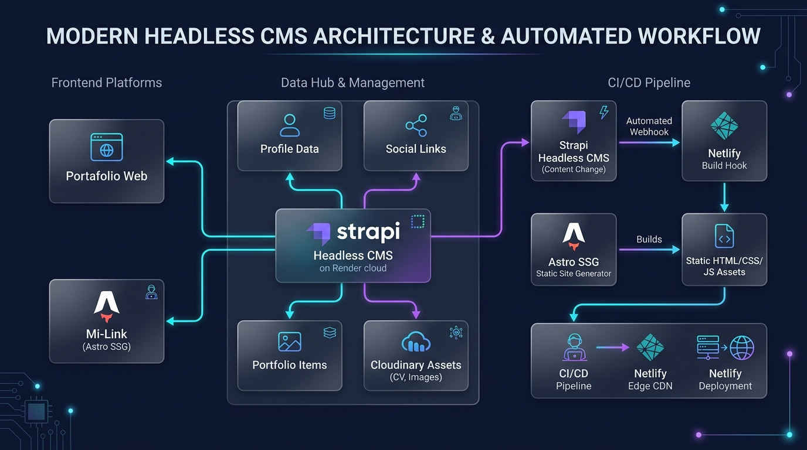

# Link de Redes con Astro SSG & Headless Architecture

Un hub de enlaces y perfil profesional para no tener que pagarle 10 dólares al mes a Linktree por cambiar el color de un botón. Construido con **Astro**, **React 19**, **Tailwind CSS v4** y alimentado por **Strapi CMS** en tiempo de compilación. Rápido, minimalista y con estética de cristal oscuro.

---

## Arquitectura del Sistema

El ecosistema sigue la filosofía Jamstack: pagar un servidor dedicado solo para mostrar seis links y un botón de WhatsApp es un crimen financiero. Aquí compilamos el HTML una sola vez y dejamos que el CDN de Netlify sufra con las visitas.

### Como funciona:

1. **Strapi Headless CMS (Backend en Render):**
   - Es la única fuente de verdad. Centraliza el nombre, biografía, redes sociales, enlaces a proyectos y el PDF del currículum alojado en Cloudinary.
   - Alimenta tanto a este sitio de enlaces como al Portafolio principal.
   - Vive en el tier gratuito de Render (sí, ese que se duerme a los 15 minutos de inactividad como tú los lunes por la mañana). Pero da igual: como usamos SSG, el visitante nunca se come los 50 segundos de cold start; solo el build de Netlify habla con él.

2. **Astro SSG (Static Site Generation):**
   - En tiempo de compilación (`build time`), Astro despierta a Strapi, descarga los datos con `loadProfile()` y genera archivos HTML/CSS/JS 100% planos dentro de `dist/`.
   - **Cero sobrecarga de cliente:** El navegador no tiene que descargar 2 MB de JavaScript ni hidratar cosas absurdas para renderizar un párrafo. Si la máquina del visitante es una laptop del gobierno de 2012 con 2GB de RAM, la web abre igual de instantánea.

3. **Automatización con Webhooks (Strapi a Netlify):**
   - Cada vez que editas o agregas una red social en Strapi y le das a guardar, Strapi le manda un golpe (HTTP POST) al Build Hook de Netlify.
   - Netlify compila la nueva versión estática y la reparte por todo el mundo en su Edge CDN en unos 30 segundos sin que tengas que tocar una sola terminal.

---

## Automatizacion con Webhooks (Strapi y Netlify)

Para que no tengas que tocar la terminal cada vez que cambias un enlace:

1. **En Netlify:**
   - Ve a `Site configuration` ➔ `Build & deploy` ➔ `Continuous deployment` ➔ **Build hooks**.
   - Crea un hook llamado `Strapi Auto Deploy` asignado a la rama `main` y copia la URL secreta que te da.
2. **En Strapi:**
   - Entra a `Settings` ➔ `Webhooks` ➔ **+ Create new webhook**.
   - Ponle de nombre `Netlify Deploy` y pega la URL del Build Hook.
   - En **Entry**, marca `create`, `update`, `delete`, `publish` y `unpublish`. Guarda los cambios.
   - Ahora, cada vez que le des a "Save" en Strapi, Netlify reconstruira el sitio en silencio mientras tu tomas cafe.
